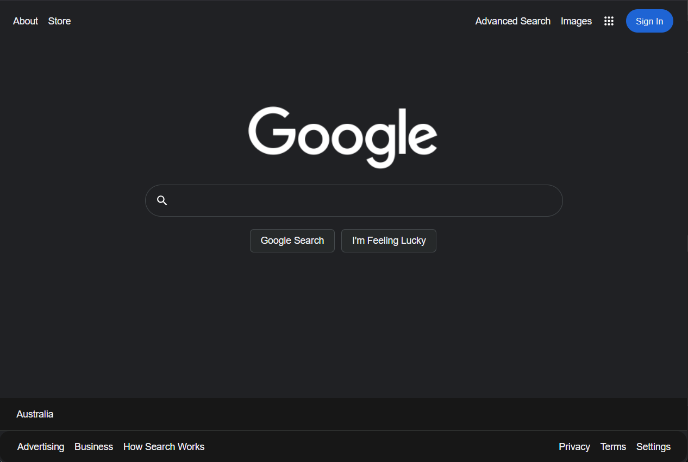
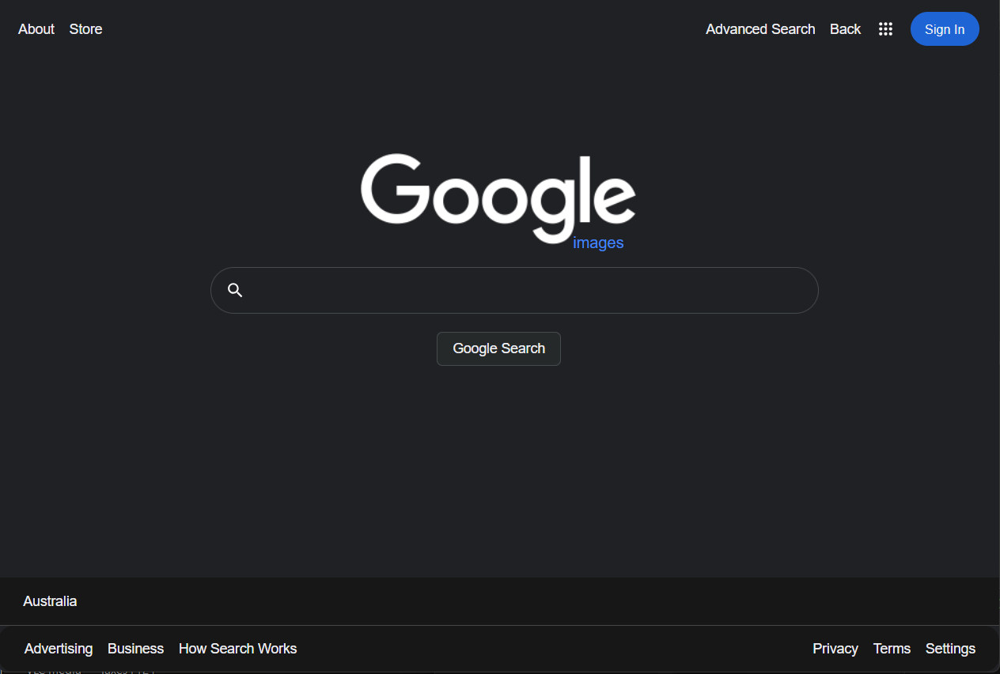
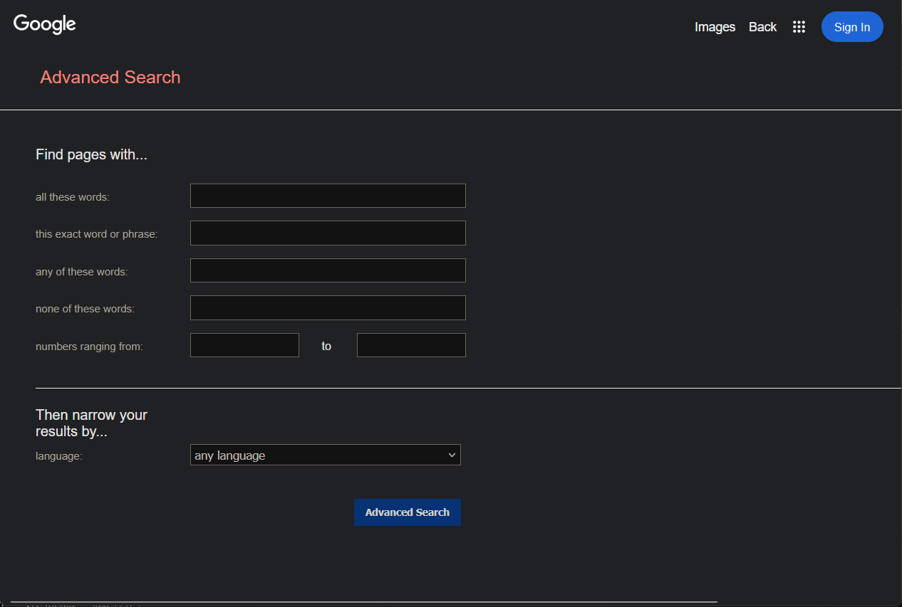

# Google Search

This repo is Project 0 from Harvard’s free online course CS50’s Web Programming with Python & JavaScript (CS50W).
The assignment: re‑create **Google Search, Google Image Search, and Google Advanced Search** using only HTML and vanilla CSS (or SASS). 

No frameworks, no JavaScript - just pure front-end fundamentals.

---
## 🗄️ Repo layout 
```
📂 google-search/
 ├── styles/
 │────── style.scss                           # SASS file used to generate the CSS
 ├── icons/                                   # Icons
 │────── ...
 ├── imgs/                                    # PNG logos
 │────── ...
 ├── screenshots/                             # Example renders (PNG)
 │────── ...
 ├── index.html                               # Google Search clone
 ├── image-search.html                        # Google Image Search clone
 ├── advanced-search.html                     # Google Advanced Search clone
 └── README.md                                # You are here
```

---

## 🖼️ Sample

<table>
  <tr>
    <td>Google Search</td>
    <td></td>
  </tr>
  <tr>
     <td>Google Image Search</td>
     <td></td>
  </tr>
  <tr>
      <td>Google Advanced Search</td>
    <td></td>
  </tr>
 </table>
    
---
